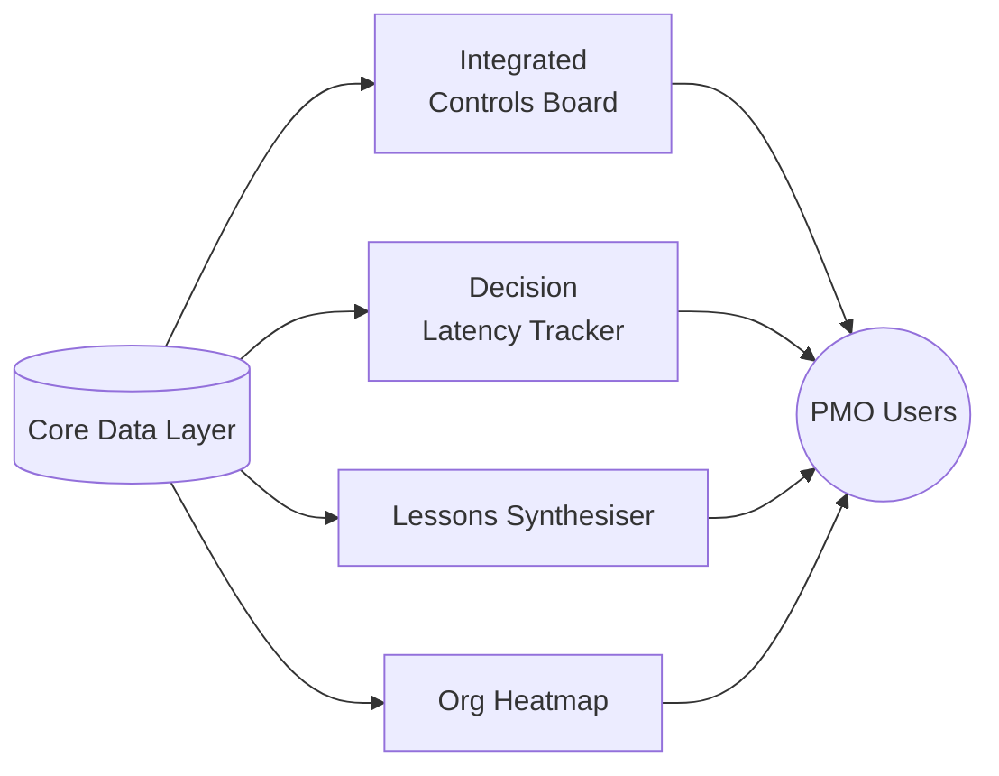

```mermaid
graph LR
  CoreData[(Core Data Layer)]
  ICC[Integrated<br>Controls Board]
  DLT[Decision<br>Latency Tracker]
  LTA[Lessons&nbsp;Synthesiser]
  OHT[Org&nbsp;Heatmap]
  PMOUsers((PMO Users))

  CoreData --> ICC
  CoreData --> DLT
  CoreData --> LTA
  CoreData --> OHT
  ICC --> PMOUsers
  DLT --> PMOUsers
  LTA --> PMOUsers
  OHT --> PMOUsers
```
